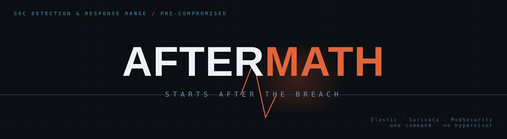
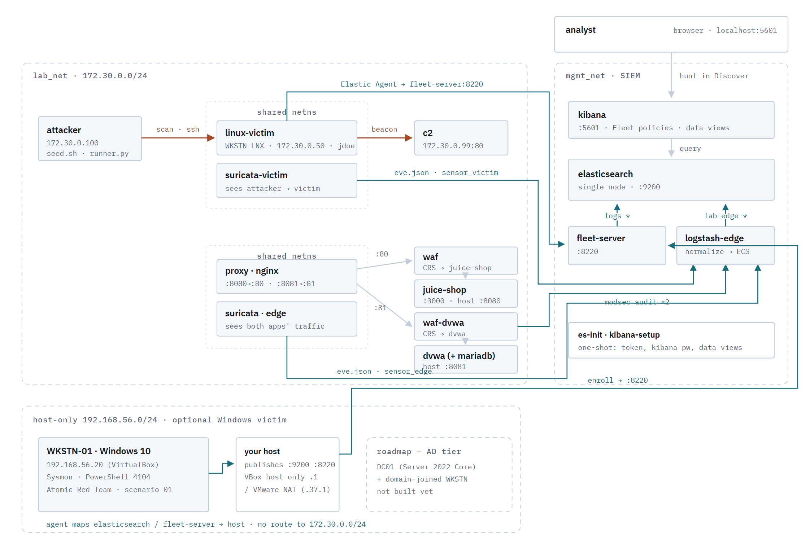

<p align="center">
  
</p>

<p align="center">
  <b>A self-contained SOC detection &amp; response range that boots <i>already compromised</i>.</b>
</p>

<p align="center">
  Most labs hand you an empty SIEM and tell you to go attack something. This one skips ahead to the part<br>
  that matters. One command stands up the full stack, stages a real intrusion, backdates the telemetry to<br>
  match the ticket you're handed, and drops you into Kibana with the alerts already firing.<br>
  Your job is the analyst's job: <b>work the case and reconstruct what happened.</b>
</p>

<p align="center">
  
  
  
  
  
  
  
  <br>
  
  
</p>

---

## 🧭 Overview

AFTERMATH is a training range for blue-team detection and response. Most ranges
put you in the attacker's seat first, which means you already know the answer
before you start investigating. AFTERMATH removes that shortcut: it provisions a
complete Elastic-based SIEM, stages a pre-built intrusion against deliberately
vulnerable victims, and backdates the telemetry so the timeline reads like a case
that landed on your desk this morning. You start where a real investigation
starts — alerts in the console, a host that's already compromised, and no idea yet
how it happened.

**The idea, in three moves:**

```text
  ①  install.*  →  full SIEM + victims + attacker stand up
  ②  the intrusion is staged and its telemetry backdated to the ticket
  ③  you open Kibana and reconstruct initial access → persistence → C2 / exfil
```

Every intrusion is defined by a single YAML file that drives **both** the attack
and its answer key, and an automated validation step confirms the promised
telemetry actually exists before the build is considered complete. If the ticket
says it's there, it's there.

---

## ⚡ Quick start

<table>
<tr>
<td>

**Windows** — requires Docker Desktop *(installed automatically if absent)*

```powershell
powershell -ExecutionPolicy Bypass -File .\install.ps1
```

</td>
<td>

**Linux / macOS** — installs Docker CE / Colima, headless

```bash
./install.sh
```

</td>
</tr>
</table>

On completion the installer prints the Kibana URL and credentials. Open
**http://localhost:5601**, review **[`SCENARIOS.md`](SCENARIOS.md)** for the
briefings, begin your investigation, and verify your findings against
**[`SOLUTIONS.md`](SOLUTIONS.md)**.

> **Viewing the alerts.** The installer runs the 14 MITRE-mapped detection rules
> against the seeded intrusion, so **Security → Alerts** is populated. Because the
> telemetry is backdated, the alerts carry historical timestamps — set the Alerts
> time range to **Last 30 days**; the default "Last 24 hours" will appear empty.

---

## 📋 Requirements

The only hard dependency is **Docker** — Docker Desktop on Windows/macOS, Docker
Engine on Linux — which the installer sets up automatically if it is absent. The
optional Windows victim additionally requires **Vagrant** and a hypervisor
(VirtualBox, or VMware if already present).

| Build | RAM | Disk |
|---|---|---|
| **Docker only** *(default)* | 8 GB minimum · 12–16 GB comfortable | ~40 GB |
| **+ Windows victim VM** | +4 GB | +10 GB box download (~40–60 GB provisioned) |

All services run on a private Docker network, and the installer binds every
published port so nothing reaches your LAN. Kibana (`5601`) and the deliberately
vulnerable web apps (`8080`, `8081`) are pinned to `127.0.0.1`; the Linux
victim's SSH (`2022`) likewise. Elasticsearch (`9200`) and Fleet (`8220`) are
also loopback-only, except when the optional Windows VM is built — it has to
reach them, so they are bound to that VM's host-only/NAT adapter (e.g.
`192.168.56.1` or `192.168.37.1`), which is a virtual interface, not your
physical network. Override with `LAB_BIND_IP` in `.env` if you need something
else; do not set it to `0.0.0.0`.

---

## 🗺️ Architecture

<p align="center">
  
  <br>
  <sub>Interactive diagram → <a href="https://salehswt.github.io/AFTERMATH/docs/architecture.html">open the live blueprint</a></sub>
</p>

| Layer | Components |
|---|---|
| **SIEM** | Elasticsearch · Kibana · Fleet · Logstash |
| **Edge** | nginx → ModSecurity WAF → Juice Shop `:8080` · DVWA `:8081` |
| **Sensors** | Suricata ×2 — one at the edge, one on the victim |
| **Victim** | Vulnerable Ubuntu container with the Elastic Agent pre-installed |
| **Attacker** | Scenario runner and an interactive command-and-control server |
| **Optional** | Windows 10 victim VM — Sysmon · PowerShell 4104 · Atomic Red Team |

**Two ingest paths:** Elastic Agent → Fleet → `logs-*`, and the sensors and WAF →
Logstash → `lab-edge-*`.

---

## 🎯 Scenario library

The range ships with **21 investigations** across three tracks. Each is a
pre-seeded, backdated intrusion accompanied by a ticket-style briefing — there is
no flag to capture, only a timeline to reconstruct.

| Track | Scenarios |
|---|---|
| 🐧 **Linux host** | brute-force foothold · privilege escalation · credential access · rogue-account persistence · beaconing implant · data exfiltration · log-wiping anti-forensics · scheduled-job (cron) persistence · full kill-chain campaign *(hard)* |
| 🌐 **Web (DVWA + Juice Shop)** | SQL injection · LFI / path traversal · command injection · XSS · automated scanning · combined campaign · Juice Shop REST-API attack |
| 🪟 **Windows** *(VM)* | phishing → persistence · privilege escalation · post-exploitation · scheduled-task & service persistence · discovery & LOLBin execution |

> **Validated answer keys.** A single YAML file per intrusion drives both the
> attack and its solution. As the final installation step, `validate_detections.py`
> executes every scenario's detection query against Elasticsearch and **reports any
> that return zero results**, so you are told immediately if a briefing promises
> telemetry that was not generated. The installer surfaces this as a warning and
> still finishes — you get a working lab plus an explicit list of what drifted,
> rather than no lab at all.

<details>
<summary><b>Authoring a new scenario</b></summary>

**Linux / macOS**
```bash
./lab.sh new-scenario                        # scaffolds scenarios/scenario_NN.yml
# edit: chain, expected_detections (with the query), iocs, answer_summary
./lab.sh validate scenarios/scenario_NN.yml
```

**Windows**
```powershell
.\lab.ps1 new-scenario                        # scaffolds scenarios\scenario_NN.yml
# edit: chain, expected_detections (with the query), iocs, answer_summary
.\lab.ps1 validate scenarios\scenario_NN.yml
```

If a chain references a technique the runner does not implement, validation fails
explicitly rather than seeding an intrusion with missing telemetry.

`validate` is a quick parse/sanity check. For the full check, seed the scenario
first, then run `./lab.sh validate-detections` (`.\lab.ps1 validate-detections`
on Windows) — it asserts every answer-key query still returns hits against live
Elasticsearch.

See **[`docs/WRITING-SCENARIOS.md`](docs/WRITING-SCENARIOS.md)** for the full authoring guide.
</details>

---

## 🎮 Operating the lab

`lab.sh` (Linux/macOS) and `lab.ps1` (Windows) are **host-side** control scripts.
They run on your machine and drive the environment externally via Docker (and
Vagrant for the optional VM); they are not executed inside a victim.

```bash
./lab.sh status              # component health            (Windows: .\lab.ps1 status)
./lab.sh attack T1059.004    # execute a single technique live
./lab.sh attack scenario_02  # replay a full chain live
./lab.sh down                # stop all services (data preserved)
./lab.sh reset               # wipe volumes, rebuild, and reseed
```

### Accessing the victims

Investigate the hosts directly — SSH to the Linux victim, RDP or SSH to the
Windows victim:

| Victim | Access from the host | Shortcut |
|---|---|---|
| 🐧 **Linux** `WKSTN-LNX` | `ssh jdoe@localhost -p 2022` — password `Password123` | `./lab.sh ssh` · `.\lab.ps1 ssh` |
| 🪟 **Windows** `WKSTN-01` | **RDP** → `localhost:53389`, or `ssh vagrant@localhost -p 2222` — login `vagrant` / `vagrant` | `./lab.sh rdp` · `.\lab.ps1 rdp` (or `winssh`) |

The Linux victim's SSH service is bound to `127.0.0.1` only. It is intentionally
weakly configured and must never be exposed to a LAN. Run `cd victim && vagrant
port` to view the VM's live port map if a default was reassigned.

---

## 🧱 Design principles

- **Honest by construction.** The runner exits non-zero on any unimplemented
  technique, the seeder counts failures, and `validate_detections.py` re-runs
  every answer-key query against the real data and reports each one that comes
  back empty. The lab never reports a compromise it did not stage, and never
  claims a query works without having just executed it.
- **Two sensors, distinct vantage points.** The edge Suricata observes only web
  traffic. A second sensor runs in the victim's network namespace to capture the
  scan, brute force, and beacons — traffic the edge sensor cannot see on a bridge
  network.
- **Investigate a case you did not stage.** Because the intrusion is generated for
  you, the outcome is not known in advance — the exercise reflects genuine
  investigative work rather than reviewing your own attack.

---

## 🪟 Optional: Windows victim

A Windows 10 host for endpoint DFIR — Sysmon, script-block logging, and macro
chains. The Windows scenarios execute genuine ATT&CK techniques on it via
[**Atomic Red Team**](https://github.com/redcanaryco/atomic-red-team). This tier
requires a hypervisor and approximately 4 GB of additional RAM. See
**[`WINDOWS-VM.md`](WINDOWS-VM.md)** for the complete guide.

```powershell
powershell -ExecutionPolicy Bypass -File .\scripts\check-windows.ps1   # resolve every [FAIL] first
powershell -ExecutionPolicy Bypass -File .\install.ps1 -WithWindowsVictim
```

> [!WARNING]
> **Antivirus will flag Atomic Red Team — this is expected.** The atomics are
> genuine attack behaviour, so Microsoft Defender (or any AV) will detect and may
> quarantine them, leaving scenario telemetry incomplete. The lab attempts to
> disable Defender on the VM (`provision/01-weaken.ps1` runs
> `Set-MpPreference -DisableRealtimeMonitoring $true`), but modern Windows
> **Tamper Protection silently overrides this**, allowing Defender to re-enable and
> re-flag the atomics. If a Windows scenario seeds no telemetry, then inside the
> **VM** disable **Tamper Protection** (Windows Security → Virus &amp; threat
> protection → Manage settings) *or* add a Defender exclusion for
> `C:\AtomicRedTeam`, then re-run `scripts\seed-windows.ps1`. This is a
> deliberately weakened, isolated host — **never disable AV on a machine connected
> to a production network.** The default Docker build does not use Atomic Red Team
> (it drives network-observable attacks from the attacker container), so this does
> not apply there.

**Roadmap:** an Active Directory tier (Server 2022 domain controller with a
domain-joined workstation) and a network/firewall tier — see the architecture
diagram.

---

<p align="center">
  <sub>The victims are intentionally vulnerable and isolated on a private network.<br>This environment is not intended to face a LAN or the internet — keep it local.</sub>
  <br><br>
  <sub><b>AFTERMATH v1</b> · built by Saleh</sub>
</p>
